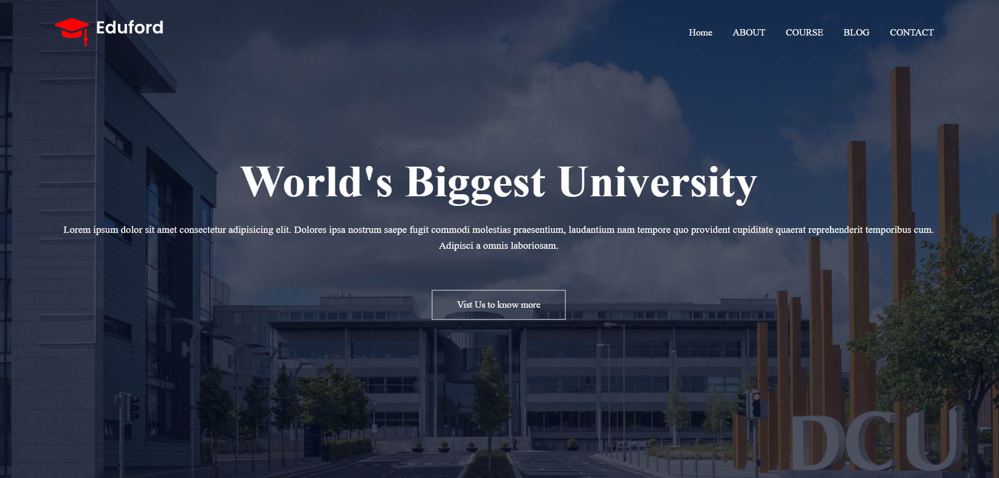

## 🌐 Landing Page – Modern UI/UX

A responsive and visually appealing Landing Page designed with modern UI elements, smooth navigation, and optimized layout for better user experience.
Built using HTML, CSS, and JavaScript, this project focuses on creating an engaging first impression for users.

---

## 🚀 Live Demo

🔗 View Project

🔗 [Try it here](https://kunal-web3.github.io/Landing-Page/)

 ---

## 🛠️ Tech Stack

HTML5 – structure & semantic elements
CSS3 – responsive styling & modern UI design
JavaScript (ES6) – smooth navigation & interactivity

---

## 📂 Project Structure

Landing-Page/
├── index.html # Main landing page
├── style.css # Stylesheet for layout & responsiveness
├── script.js # Interactivity & navigation logic
└── assets/ # Images, icons, and fonts

---

## 📸 Preview :

---

## ✨ Features :

📱 Fully responsive across devices
🎨 Modern & clean UI design
🧭 Smooth navigation bar with section highlights
⚡ Optimized for fast performance

---

## 🎯 Learning Outcomes

📌 Strengthened skills in responsive web design
📌 Practiced CSS Flexbox & Grid for layouts
📌 Improved frontend interactivity using JavaScript
📌 Enhanced understanding of UI/UX principles

---

## 🙌 Acknowledgements

Special thanks to Oasis Infobyte (OIBSIP) for the opportunity and guidance.

---

## 📢 Connect with Me  

🔗 [LinkedIn](https://www.linkedin.com/in/kunal-jadhav-kj) | 🌐 [GitHub](https://github.com/kunal-web3)

---